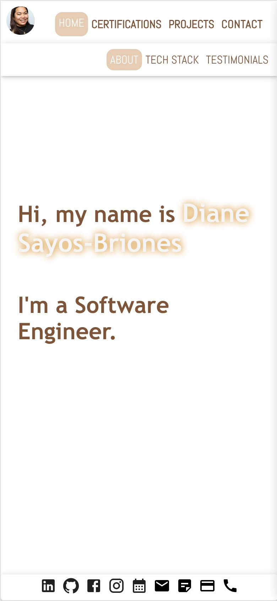
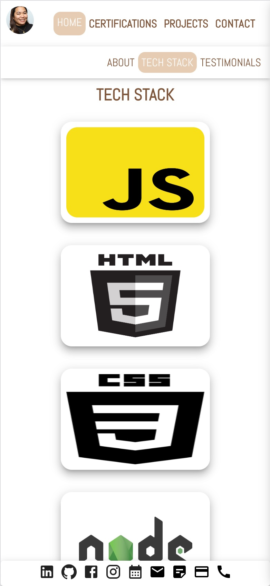
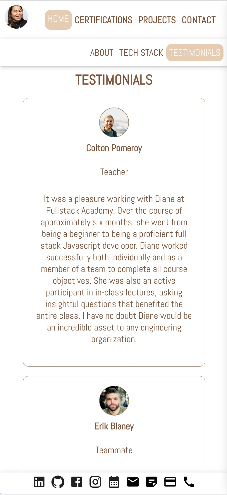
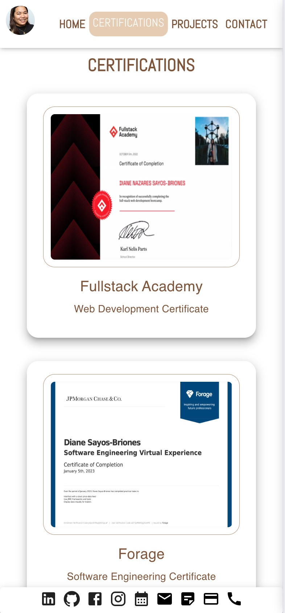
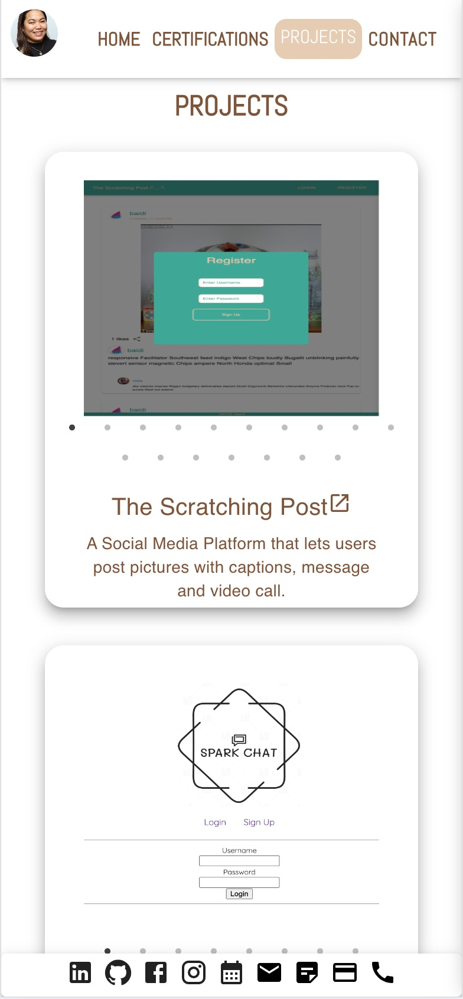
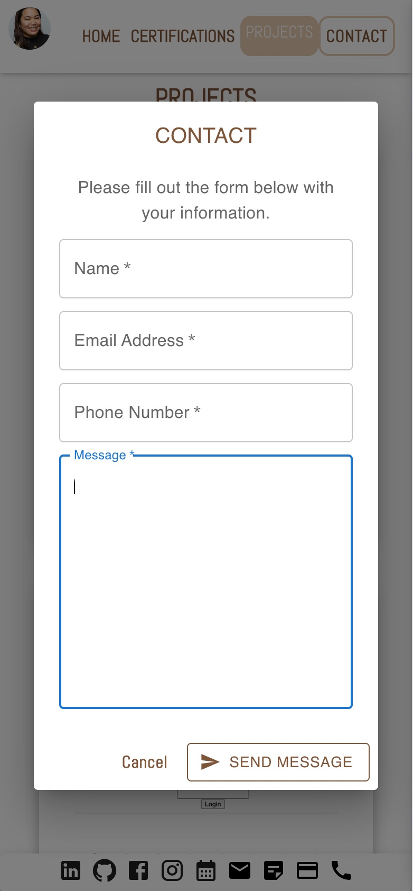
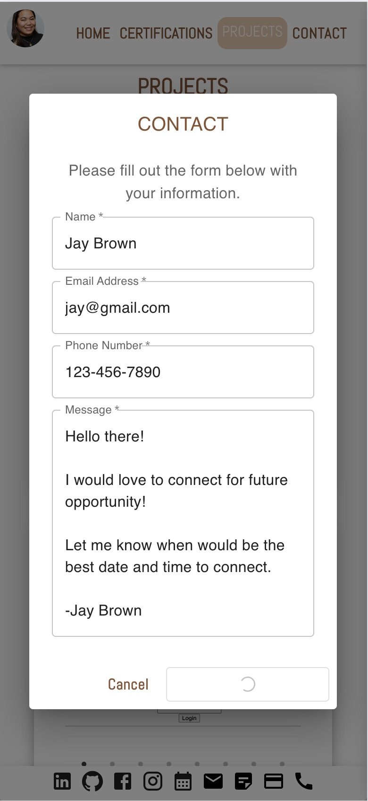
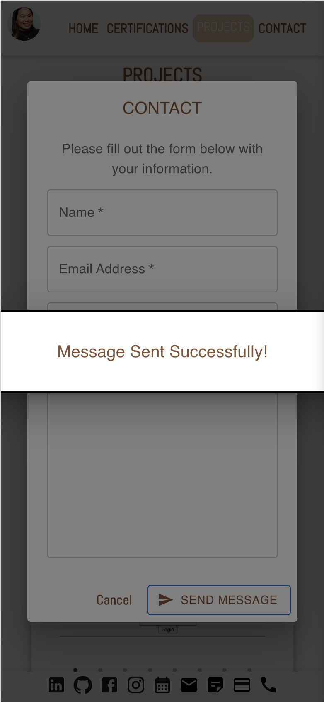

# Portfolio

    
<h2>Deployed Link</h2>

    https://dianesayosbriones.netlify.app/

    
<h2>Description</h2>

    Portfolio website that shows all my tech stack, testimonials on the Home Page. You can see all my certifications when you navigate to the certifications page.
    All my projects are also displayed on this portfolio and can direct viewers to th corresponding github repository once the project's title has been clicked.
    There is also a contact form that lets viewers input their name, email address, callback number and message they would love to leave for me.
    All the icons located in the footer are accessible to get my information such as: LinkedIn, Github, my resume, my business card. You could also schedule an appointment through calendly, sends me an email using your personal email, or give me a call using one of the icons.

    
<h2>Tech Stack</h2>

    Javascript ||
    React ||
    Redux ||
    React-Slick ||
    Material UI ||
    EmailJS

    
View App Functionalities

    <h2>Home Page</h2> 
    
    <h2>Techstack Page</h2> 
    
    <h2>Testimonials Page</h2> 
    
    <h2>Certifications Page</h2> 
    
    <h2>Projects Page</h2> 
    
    <h2>Contact Page</h2> 
    
    <h2>Contact Page Loading Button</h2> 
    
    <h2>Contact Page Message Success Notification</h2> 
    

